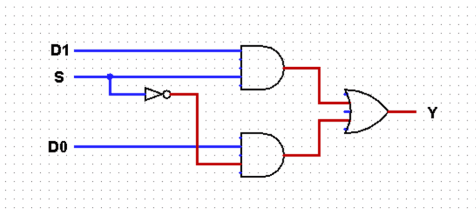
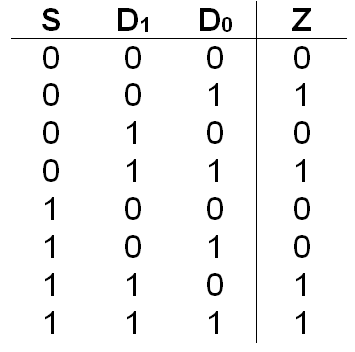

# Circuit Description

# How to run
Please reference root README for instructions on the
installation of iverilog.

`$ i verilog -o two_one_mux_tb.o two_one_mux_tb.v`

# Circuit Diagram

# Truth Table

